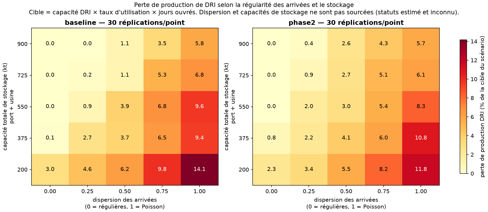

# Jumeau numérique du corridor Djen Djen–Bellara

**Question :** le corridor port de Djen Djen → rail → usine sidérurgique de Bellara
peut-il absorber un doublement de la production ? Si non, quel est le premier goulot ?

> Étude indépendante à but de portfolio, construite uniquement sur des données publiques.
> Non affiliée à Algerian Qatari Steel ni à l'Entreprise Portuaire de Djen Djen.

## État d'avancement

- [x] Semaine 1 : collecte automatique de la situation portuaire (3×/jour)
- [x] Semaines 2–3 : parser, normalisation, table des escales
- [x] Semaines 4–7 : simulation SimPy v1 et analyse de sensibilité
- [ ] Suite : ML, optimisation des stocks, tableau de bord

## Lancer en local

```bash
python -m venv .venv && source .venv/bin/activate   # Windows : .venv\Scripts\activate
pip install -e ".[dev]"
pytest -q                                   # 214 tests, hors ligne
python -m corridor.ingest.port_status       # une collecte
python scripts/inspect_latest.py            # voir le contenu du dernier PDF

python -m corridor.sim.run --scenario baseline --years 1 --reps 50
python -m corridor.sim.sensitivity          # la figure ci-dessous, ~3 min 30
```

## Résultats préliminaires

> **Ces chiffres ne sont pas des prévisions.** Les deux paramètres qui les pilotent ne sont
> pas sourcés : la **régularité des arrivées** de minéraliers (statut *estimé*, jamais
> mesurée) et les **capacités de stockage** du port et de l'usine (statut *inconnu*). Le
> reste des hypothèses est documenté, chiffré et daté dans
> [`config/assumptions.yaml`](config/assumptions.yaml).

### Le corridor absorbe le doublement — si les navires arrivent régulièrement

50 réplications d'une année, politique d'expédition ferroviaire `pull`.

| Scénario | Arrivées | Production DRI | Cible | Perte | Arrêts DRI | Attente en rade | Poste | Rames |
| --- | --- | ---: | ---: | ---: | ---: | ---: | ---: | ---: |
| baseline | régulières | 2,009 Mt | 2,009 Mt | 0,0 % | 0 h | 0 h | 31,9 % | 36,3 % |
| phase2 | régulières | 4,011 Mt | 4,017 Mt | 0,1 % | 12 h | 0,1 h | 63,8 % | 71,3 % |
| phase2 + stockage | régulières | 4,017 Mt | 4,017 Mt | 0,0 % | 0 h | 0 h | 63,7 % | 72,7 % |
| baseline | Poisson | 1,850 Mt | 2,009 Mt | **7,9 %** | 652 h | 297 h | 57,3 % | 33,2 % |
| phase2 | Poisson | 3,615 Mt | 4,017 Mt | **10,0 %** | 828 h | 301 h | 71,1 % | 64,3 % |
| phase2 + stockage | Poisson | 3,800 Mt | 4,017 Mt | **5,4 %** | 447 h | 193 h | 69,5 % | 68,3 % |

À demande égale, passer d'un affrètement parfaitement régulier à des arrivées de Poisson
coûte **8 à 10 % de la production annuelle de DRI**, et fait passer l'attente moyenne en rade
de zéro à plus de 290 heures. Le doublement de production, lui, se passe sans incident tant
que les arrivées restent régulières.

**Ce n'est pas le rail qui limite.** Un scénario à six rames au lieu de trois a été testé puis
abandonné : à arrivées régulières il ne change rien (4,011 Mt dans les deux cas, il divise
seulement par deux l'utilisation des rames), et à arrivées de Poisson il ne récupère que
1,4 point de perte (10,0 % → 8,6 %). Il a été remplacé par `phase2_plus_stockage`, qui porte
les deux capacités de stockage en haut de leur fourchette et récupère, lui, 4,6 points
(10,0 % → 5,4 %) : à effort comparable, le stockage rend trois fois plus que le rail.

### Ce qui limite vraiment : régularité des arrivées × stockage



Grille de 5 dispersions × 5 capacités totales de stockage × 2 scénarios, 30 réplications par
point. La capacité totale balaie la somme des deux fourchettes publiées (200 kt à 900 kt),
répartie entre port et usine selon les proportions des hypothèses centrales.

Trois lectures :

- **La perte est gouvernée par les deux axes à la fois.** Au coin défavorable (200 kt,
  arrivées de Poisson), la baseline perd 14,1 % de sa production ; au coin favorable, 0 %.
  Toute conclusion sur la capacité du corridor est donc suspendue à deux paramètres qu'il
  reste à mesurer.
- **Même des arrivées parfaitement régulières ne suffisent pas si le stockage est au plus
  bas** : 3,0 % de perte en baseline à 200 kt, parce que le tampon ne couvre plus l'intervalle
  entre deux navires.
- **La phase 2 est relativement plus robuste que la baseline** à faible stockage (11,8 %
  contre 14,1 % à 200 kt et dispersion 1) : deux fois plus de navires, donc des livraisons
  deux fois plus fréquentes et une variance relative plus faible, pour un même tampon.

### Limites de ces résultats

La table des escales n'a encore jamais tourné sur une vraie série : le dépôt ne contient
**qu'un seul instantané réel**, et les transitions du cycle de vie des navires sont validées
sur des séquences synthétiques. Les exports, la houle, les surestaries et les temps morts à
quai sont hors périmètre de la v1. Le détail figure dans [CLAUDE.md](CLAUDE.md), section
« Limites connues ».

## Données collectées

`data/raw/port_status/` contient les PDF bruts, horodatés en UTC, et `_manifest.csv`
qui trace chaque tentative (`new`, `unchanged` ou `error`). Un PDF identique au
précédent n'est pas dupliqué, mais l'observation est consignée.

Les sorties de simulation vont dans `data/sim/*.parquet` (git-ignorées : elles se
recalculent). Les figures versionnées sont dans `docs/`.
