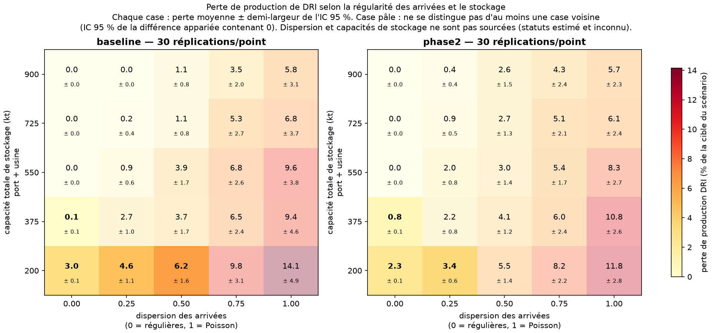

# Jumeau numérique du corridor Djen Djen–Bellara

**Question :** le corridor port de Djen Djen → rail → usine sidérurgique de Bellara
peut-il absorber un doublement de la production ? Si non, quel est le premier goulot ?

> Étude indépendante à but de portfolio, construite uniquement sur des données publiques.
> Non affiliée à Algerian Qatari Steel ni à l'Entreprise Portuaire de Djen Djen.

## État d'avancement

- [x] Semaine 1 : collecte automatique de la situation portuaire (3×/jour)
- [x] Semaines 2–3 : parser, normalisation, table des escales
- [x] Semaines 4–7 : simulation SimPy v1 et analyse de sensibilité
- [ ] Suite : ML, optimisation des stocks, tableau de bord

## Lancer en local

```bash
python -m venv .venv && source .venv/bin/activate   # Windows : .venv\Scripts\activate
pip install -e ".[dev]"
pytest -q                                   # 214 tests, hors ligne
python -m corridor.ingest.port_status       # une collecte
python scripts/inspect_latest.py            # voir le contenu du dernier PDF

python -m corridor.sim.run --scenario baseline --years 1 --reps 50
python -m corridor.sim.sensitivity          # la figure ci-dessous, ~3 min 30
```

## Résultats préliminaires

> **Ces chiffres ne sont pas des prévisions.** Les deux paramètres qui les pilotent ne sont
> pas sourcés : la **régularité des arrivées** de minéraliers (statut *estimé*, jamais
> mesurée) et les **capacités de stockage** du port et de l'usine (statut *inconnu*). Le
> reste des hypothèses est documenté, chiffré et daté dans
> [`config/assumptions.yaml`](config/assumptions.yaml).

> **Comment lire les intervalles.** Chaque chiffre est une moyenne sur 50 réplications d'une
> année, suivie de la demi-largeur de son intervalle de confiance à 95 %
> (moyenne ± 1,96 σ/√n). Deux configurations sont comparées **en données appariées** : elles
> partagent la même graine maîtresse, donc la réplication i de l'une et celle de l'autre
> voient la même séquence aléatoire, et c'est l'intervalle de leur *différence* qui décide.
> Un écart est dit **significatif** quand cet intervalle exclut zéro. Le détail est
> reproductible par `python scripts/compare_scenarios.py --reps 50`.

### Le corridor absorbe le doublement — si les navires arrivent régulièrement

50 réplications d'une année, politique d'expédition ferroviaire `pull`.

| Scénario | Arrivées | Production DRI (Mt) | Cible | Perte | Arrêts DRI (h) | Attente en rade (h) | Poste (%) | Rames (%) |
| --- | --- | ---: | ---: | ---: | ---: | ---: | ---: | ---: |
| baseline | régulières | 2,009 ± 0,000 | 2,009 | 0,0 % | 0 ± 0 | 0,0 ± 0,0 | 31,9 ± 0,3 | 36,3 ± 0,0 |
| phase2 | régulières | 4,011 ± 0,002 | 4,017 | 0,1 % | 12 ± 4 | 0,1 ± 0,0 | 63,8 ± 0,4 | 71,3 ± 0,1 |
| phase2 + stockage | régulières | 4,017 ± 0,000 | 4,017 | 0,0 % | 0 ± 0 | 0,0 ± 0,0 | 63,7 ± 0,5 | 72,7 ± 0,0 |
| baseline | Poisson | 1,850 ± 0,062 | 2,009 | **7,9 %** | 652 ± 257 | 297 ± 103 | 57,3 ± 7,1 | 33,2 ± 1,2 |
| phase2 | Poisson | 3,615 ± 0,127 | 4,017 | **10,0 %** | 828 ± 261 | 301 ± 98 | 71,1 ± 5,3 | 64,3 ± 2,3 |
| phase2 + stockage | Poisson | 3,800 ± 0,074 | 4,017 | **5,4 %** | 447 ± 152 | 193 ± 50 | 69,5 ± 3,8 | 68,3 ± 1,5 |

**Régulier contre Poisson : significatif partout.** Sur les trois scénarios, le passage aux
arrivées de Poisson dégrade tous les indicateurs bien au-delà de leur intervalle — par exemple
en baseline, −0,158 ± 0,062 Mt de production, +652 ± 257 h d'arrêt et +297 ± 103 h d'attente.
À demande égale, l'irrégularité de l'affrètement coûte **8 à 10 % de la production annuelle**.
Le doublement de production, lui, se passe sans incident tant que les arrivées restent régulières.

**Pull contre push : presque jamais significatif.** La politique d'expédition ferroviaire ne
change la production de façon certaine que dans **un seul cas sur six** :

| Comparaison pull − push | Production DRI | Verdict |
| --- | ---: | --- |
| baseline, régulières | 0,000 ± 0,000 Mt | non significatif |
| baseline, Poisson | **+0,059 ± 0,040 Mt** | **significatif** |
| phase2, régulières | −0,001 ± 0,002 Mt | non significatif |
| phase2, Poisson | −0,012 ± 0,087 Mt | non significatif |
| phase2 + stockage, régulières | 0,000 ± 0,000 Mt | non significatif |
| phase2 + stockage, Poisson | +0,045 ± 0,071 Mt | non significatif |

Le seul écart systématique est structurel : en `pull`, `rame_blocked_h` vaut zéro par
construction, contre 1 600 à 10 300 h en `push`. L'écart d'attente en rade que suggéraient les
moyennes en baseline/Poisson (297 h contre 204 h) n'est **pas** significatif non plus
(+93 ± 120 h). Autrement dit : la politique d'expédition change ce que font les rames, pas ce
que produit l'aciérie.

**Ce n'est pas le rail qui limite.** Un scénario à six rames au lieu de trois a été testé puis
abandonné : à arrivées régulières il ne change rien (4,011 Mt dans les deux cas, il divise
seulement par deux l'utilisation des rames), et à arrivées de Poisson il ne récupère que
1,4 point de perte (10,0 % → 8,6 %). Il a été remplacé par `phase2_plus_stockage`, qui porte
les deux capacités de stockage en haut de leur fourchette et récupère, lui, 4,6 points
(10,0 % → 5,4 %) : à effort comparable, le stockage rend trois fois plus que le rail.

**Un second poste de déchargement ne change pas la production (résultat non concluant).** Le
scénario `phase2_plus_poste` double le poste de déchargement (`postes_minerai` 1 → 2, haut de sa
fourchette) sans toucher au reste. 30 réplications appariées, politique `pull` :

| Phase 2, 1 poste − 2 postes | 1 poste | 2 postes | Production, 2 postes − 1 poste |
| --- | ---: | ---: | --- |
| arrivées régulières | 4,011 ± 0,002 Mt | 4,011 ± 0,002 Mt | 0,000 ± 0,001 Mt, non significatif |
| arrivées de Poisson | 3,515 ± 0,184 Mt | 3,644 ± 0,129 Mt | +0,129 ± 0,157 Mt, non significatif |

À arrivées régulières le poste n'a aucun effet, comme attendu : il n'est occupé qu'à 64 %. En
Poisson, l'estimation ponctuelle va dans le bon sens (+0,13 Mt, attente en rade 291 h → 163 h)
mais **les intervalles contiennent zéro** : ni la production ni l'attente ne se distinguent
significativement (l'occupation du poste, elle, baisse de façon significative, ce qui est
mécanique). Ce test **n'établit donc pas** que le poste unique soit le goulot, et n'établit pas
non plus le contraire : 30 réplications ne suffisent pas à trancher un écart de cet ordre. Il
affaiblit la formule « le poste unique est la ressource contrainte » de la section sur le stock
flottant, qui doit être lue comme une hypothèse de mécanisme, pas comme un résultat. Trancher
demanderait plus de réplications (`python scripts/compare_scenarios.py --reps 200`).

### Ce qui limite vraiment : régularité des arrivées × stockage



Grille de 5 dispersions × 5 capacités totales de stockage × 2 scénarios, 30 réplications par
point. La capacité totale balaie la somme des deux fourchettes publiées (200 kt à 900 kt),
répartie entre port et usine selon les proportions des hypothèses centrales. Chaque case porte
sa perte moyenne et la demi-largeur de son IC 95 %. **Une case pâle ne se distingue pas
significativement d'au moins une de ses quatre voisines** (l'IC 95 % de la différence appariée
contient zéro) : la nuance de couleur qui l'en sépare ne doit pas être interprétée.

Quatre lectures :

- **La perte est gouvernée par les deux axes à la fois.** Au coin défavorable (200 kt,
  arrivées de Poisson), la baseline perd 14,1 ± 4,9 % de sa production ; au coin favorable,
  0,0 ± 0,0 %. Toute conclusion sur la capacité du corridor est donc suspendue à deux
  paramètres qu'il reste à mesurer.
- **Le coin fiable est celui des arrivées régulières.** À dispersion 0 et 0,25, les intervalles
  sont étroits (± 0,1 à ± 1,1) et les cases se distinguent nettement les unes des autres. À
  dispersion 0,75 et 1, ils atteignent ± 5 points et la moitié de la carte devient pâle :
  **30 réplications ne suffisent pas pour ordonner ces cases entre elles**. Le gradient global
  reste net, le détail case à case ne l'est pas.
- **Même des arrivées parfaitement régulières ne suffisent pas si le stockage est au plus
  bas** : 3,0 ± 0,1 % de perte en baseline à 200 kt, parce que le tampon ne couvre plus
  l'intervalle entre deux navires. C'est l'un des résultats les plus solides de la carte.
- **La phase 2 est relativement plus robuste que la baseline** à faible stockage (11,8 ± 2,8 %
  contre 14,1 ± 4,9 % à 200 kt et dispersion 1) : deux fois plus de navires, donc des livraisons
  deux fois plus fréquentes et une variance relative plus faible, pour un même tampon. Les
  intervalles se recouvrant, cet écart-là demanderait plus de réplications pour être affirmé.

### Le « stock flottant » en rade n'est pas un tampon : hypothèse réfutée

Un minéralier qui attend en rade porte ~140 000 t de minerai déjà achetées, à quelques heures
du quai. L'hypothèse testée était la suivante : **ce tonnage servirait de tampon flottant que le
corridor peut rappeler dès que le stock usine baisse**, donc plus il est élevé, plus la perte de
production devrait être faible. L'indicateur `waiting_tonnage_mean_t` mesure ce tonnage intégré
dans le temps, puis moyenné sur l'année, exactement comme les heures d'immobilisation des rames.

**La corrélation va dans l'autre sens.** Sur les 50 points de la grille de sensibilité (tous
scénarios, toutes dispersions, toutes capacités) :

| Corrélation stock flottant ↔ perte de DRI | Valeur |
| --- | ---: |
| Pearson, sur les 50 points | **+0,87** |
| Spearman, sur les 50 points | **+0,91** |
| Pearson à stockage fixé (200 / 375 / 550 / 725 / 900 kt) | +0,88 / +0,94 / +0,73 / +0,83 / +0,87 |
| Pearson à dispersion fixée (0,25 / 0,50 / 0,75 / 1,00) | +0,58 / +0,84 / +0,64 / +0,58 |

Plus il y a de minerai en attente en rade, **plus** la production est perdue. La relation tient
en neutralisant chacun des deux axes de la grille séparément, donc elle n'est pas un simple
artefact de la dispersion des arrivées. Le seul coefficient négatif (−0,33 à dispersion nulle)
porte sur des stocks flottants de 0 à 30 tonnes — trois ordres de grandeur sous les autres
points, où ils atteignent 190 000 t : c'est du bruit sur des valeurs nulles, pas un contre-signal.

Le mécanisme se lit directement dans les données de la baseline : le stock flottant monte avec
l'occupation du poste et l'attente en rade, pas contre elles.

| Stockage | Dispersion | Stock flottant | Attente | Occupation du poste | Perte DRI |
| ---: | ---: | ---: | ---: | ---: | ---: |
| 900 kt | 0,00 | 0,0 kt | 0 h | 31,9 % | 0,0 % |
| 550 kt | 0,50 | 2,0 kt | 5 h | 35,2 % | 3,9 % |
| 375 kt | 1,00 | 115,9 kt | 261 h | 57,0 % | 9,4 % |
| 200 kt | 1,00 | 190,3 kt | 446 h | 65,4 % | 14,1 % |

**Le minerai en rade n'est pas un stock mobilisable : c'est du minerai coincé derrière le même
goulot qui affame l'aciérie.** Le poste de déchargement unique serait la ressource contrainte
(hypothèse **non confirmée** : un second poste n'améliore pas la production de façon
significative, voir plus haut) ; quand il sature, le minerai s'accumule en rade *et* le four s'arrête, pour la même raison. Un tampon ne
sert que s'il est en aval du goulot — ici, le stock flottant est en amont.

> **Corrélation n'est pas causalité.** Ces 50 points sont des sorties d'un même modèle, pas des
> observations : la corrélation décrit le comportement du modèle sous ses hypothèses, elle ne
> démontre aucun mécanisme dans le port réel. Elle est de plus mesurée sur des moyennes de points
> de grille, et non sur des réplications individuelles. Enfin, le chiffrage en argent ci-dessous repose sur une hypothèse **estimée** et non
spécifique à l'Algérie.

### Ce que cela coûte : ordres de grandeur seulement

`couts.cout_journee_arret_dri` vaut 130 000 USD/jour, fourchette [40 000 ; 230 000], statut
`estimé` : il est dérivé de marges de fours à arc électrique chinois sur le rond à béton
(7 à 44 USD/t), pas de données algériennes. Il correspond à une journée de production de la
capacité actuelle (~22 USD/t, [7 ; 40]). `python scripts/economic_summary.py` convertit la perte
de production (politique `pull`, 30 réplications) en coût annuel ; la fourchette cumule l'IC 95 %
de la simulation et celle de l'hypothèse :

| Scénario | Arrivées | Perte de DRI | Coût annuel (fourchette) |
| --- | --- | ---: | ---: |
| baseline | régulières | ≈ 0 | < 1 M USD |
| baseline | Poisson | 0,16 ± 0,08 Mt | ~4 M USD (1 à 10) |
| phase 2 | régulières | ≈ 0 | < 1 M USD |
| phase 2 | Poisson | 0,50 ± 0,18 Mt | ~11 M USD (2 à 27) |
| phase 2 + stockage | Poisson | 0,23 ± 0,09 Mt | ~5 M USD (1 à 13) |
| phase 2 + second poste | Poisson | 0,37 ± 0,13 Mt | ~8 M USD (2 à 20) |

Ces montants sont **des ordres de grandeur**, arrondis au million : ils dépendent d'une marge
étrangère au site, d'une dispersion des arrivées non mesurée et de capacités de stockage
inconnues. Ils servent à comparer des scénarios entre eux, pas à chiffrer un préjudice.

### Limites de ces résultats

La table des escales n'a encore jamais tourné sur une vraie série : douze instantanés réels
sont archivés depuis le 2026-09-28, mais les transitions du cycle de vie des navires restent
validées sur des séquences synthétiques. Les exports, la houle, les surestaries et les temps morts à
quai sont hors périmètre de la v1. Le détail figure dans [CLAUDE.md](CLAUDE.md), section
« Limites connues ».

## Données collectées

La collecte tourne 3×/jour sur GitHub Actions et sépare trois choses :

| Quoi | Où | Versionné |
| --- | --- | --- |
| PDF bruts, un par collecte | releases `raw-AAAA-MM` | non (assets de release) |
| Index des collectes | `data/raw/port_status/_manifest.csv` | oui |
| Observations de navires | `data/clean/observations.csv` | oui |

Le manifeste trace chaque tentative (`new`, `unchanged`, `error`), l'empreinte du fichier,
l'empreinte du **contenu** et la référence de l'asset de release. Les PDF ne sont pas dans
git : à ~580 Ko pièce et 3 collectes par jour, le dépôt aurait grossi de ~600 Mo par an.
Pour tout reparser en local :

```bash
python scripts/fetch_raw.py                               # récupère les PDF des releases
python -m corridor.transform.observations_csv --rebuild    # régénère la table propre
```

**Un piège de la source, à connaître avant de réutiliser ces données.** L'en-tête du PDF
(« Djen-Djen : AAAA-MM-JJ HH:MM ») est l'heure à laquelle le serveur du port **génère le
document** : elle coïncide à la minute près avec l'heure de téléchargement. Ce n'est pas
l'heure de mise à jour des données, que le PDF ne publie nulle part. Deux PDF décrivant la
même situation diffèrent donc toujours octet par octet, et c'est l'empreinte du contenu
(navire, statut, poste, cargaison, tonnage, heure d'événement) qui dit si la situation a
changé — sur les douze premières collectes, deux se sont révélées identiques.

Les sorties de simulation vont dans `data/sim/*.parquet` (git-ignorées : elles se
recalculent). Les figures versionnées sont dans `docs/`.
